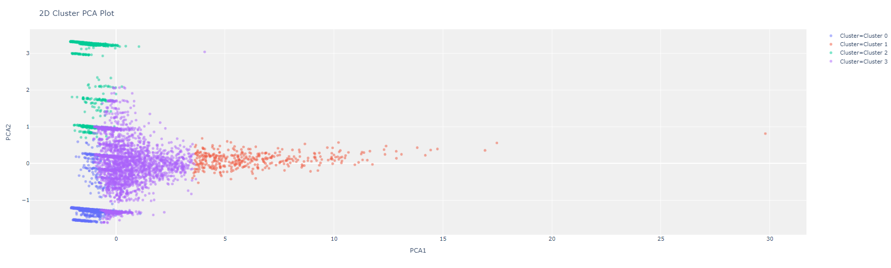

## Customer Segmentation
We use [Supermarket data](https://drive.google.com/u/0/uc?export=download&confirm=He6k&id=1xbh4FBFpYkOz1TFHMPtrPCsfn7TFOV1H) to cluster existing customers of the supermarket.

# Supermarket data
  

# Transform data to customer single view

# Use the K-means function to clustering

# Interpert result
  

# Use Decision Tree to create a rule for clustering
  
