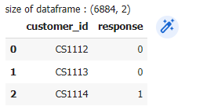
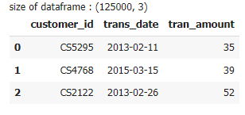
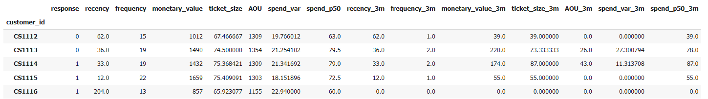
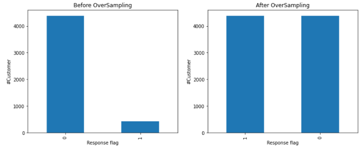
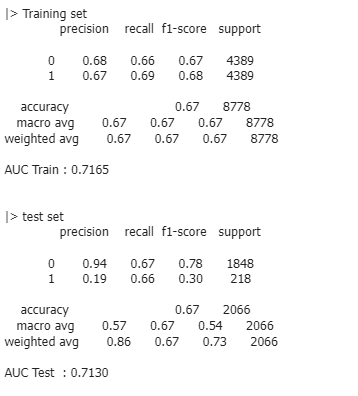
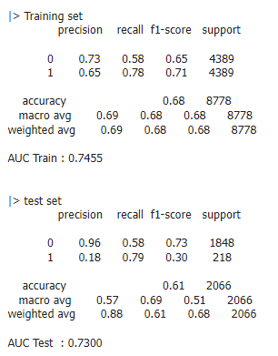

## Campaign Response
We use Retail_Data_Response (customer level) and Retail_Data_Transactions (transactions level) for prediction customer response.

## Retail_Data_Response

## Retail_Data_Transactions

## Data for training model
We create a feature at customer level from Retail_Data_Transactions and then join with Retail_Data_Response

## Fix imbalanced data with Oversampling (SMOTE)

## Logistic Regression

## XGBoost
