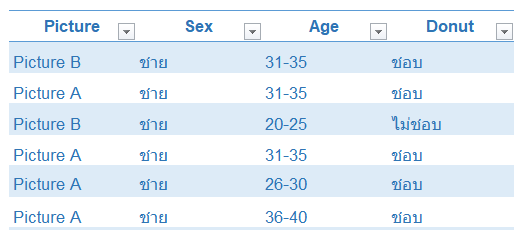
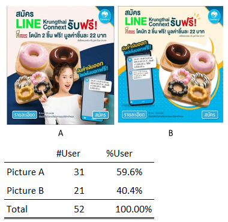
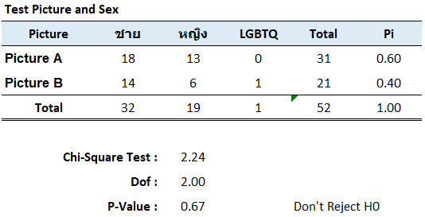
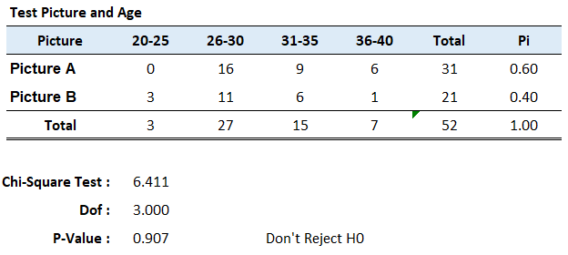
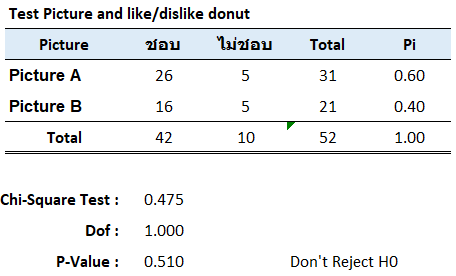
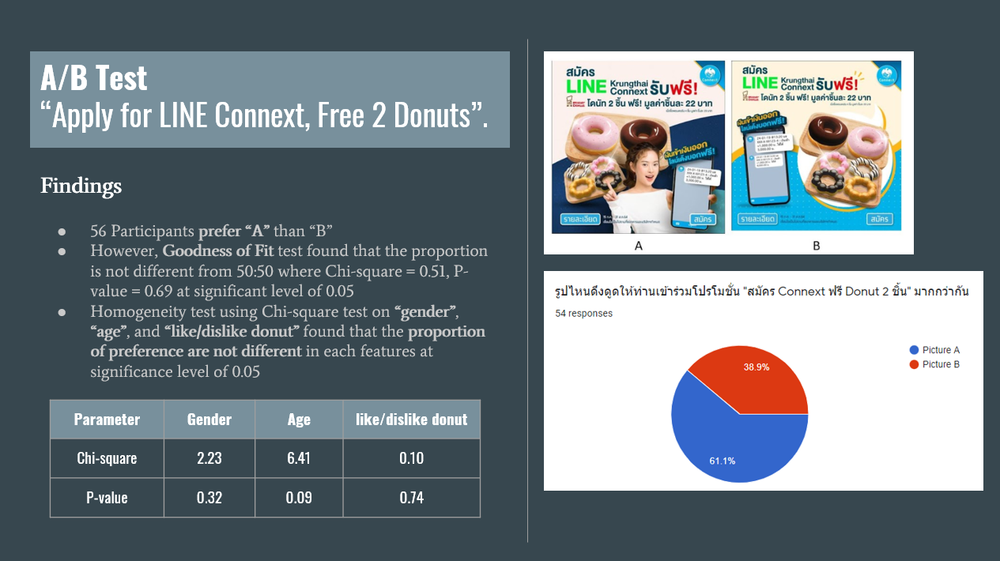

## A/B Testing
we would like to test the attractiveness of marketing campaign between picture A and picture B as below picutre.
The sample is my classmate (about 52 people) and we use the Chi-Square test for testing significance.
[Questionaire](https://docs.google.com/forms/d/e/1FAIpQLSfDBjzhJbiTEeunO3NAN2ppkz84qLMRKHuXl7TAgYo4Am-FYQ/viewform)

## Example Servey data

## Testing Result

## Summary

