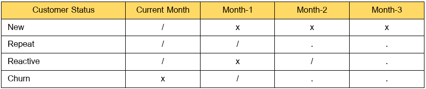
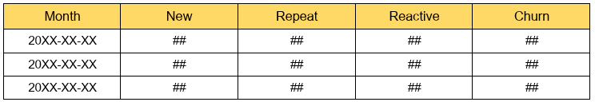
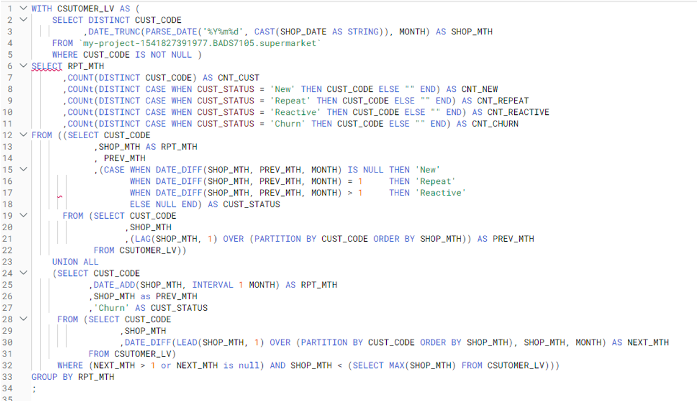
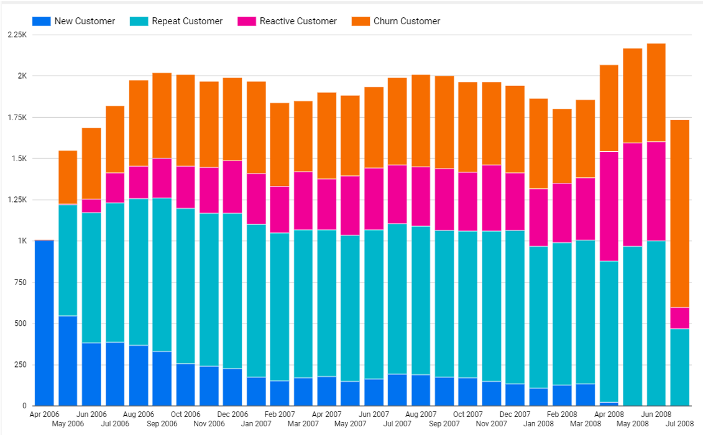

## Customer Movement Analysis
We use google big queries to query data and create charts for customer movement analysis.

[-][Register Google Bigquery](https://yo-thorn.medium.com/gcp-series-%E0%B8%A1%E0%B8%B2%E0%B8%A5%E0%B8%AD%E0%B8%87%E0%B9%83%E0%B8%8A%E0%B9%89%E0%B8%87%E0%B8%B2%E0%B8%99-google-cloud-%E0%B8%81%E0%B8%B1%E0%B8%99-%E0%B9%80%E0%B8%A3%E0%B8%B4%E0%B9%88%E0%B8%A1%E0%B8%81%E0%B8%B1%E0%B8%99%E0%B8%97%E0%B8%B5%E0%B9%88%E0%B8%81%E0%B8%B2%E0%B8%A3%E0%B8%AA%E0%B8%A1%E0%B8%B1%E0%B8%84%E0%B8%A3%E0%B9%80%E0%B8%A5%E0%B8%A2-bf5f71fdf06f)
[-][Create Project and Import](https://yo-thorn.medium.com/gcp-series-%E0%B8%A1%E0%B8%B2%E0%B8%A5%E0%B8%AD%E0%B8%87%E0%B9%83%E0%B8%8A%E0%B9%89-google-bigquery-%E0%B8%81%E0%B8%B1%E0%B8%99%E0%B8%94%E0%B8%B5%E0%B8%81%E0%B8%A7%E0%B9%88%E0%B8%B2-1a0f2f2c6049)

#Status Logits Code

#Expected Final Table

#SQL Code

#Stacked Bar Chart

