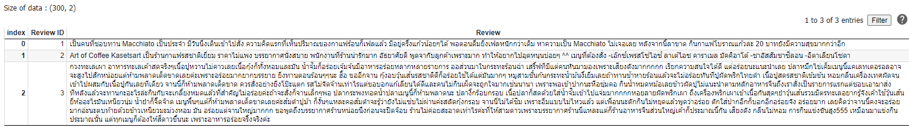
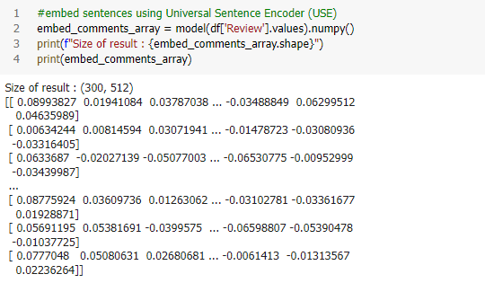
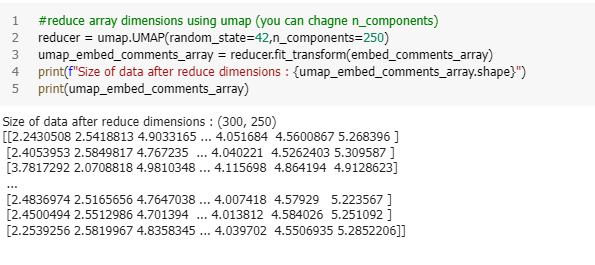
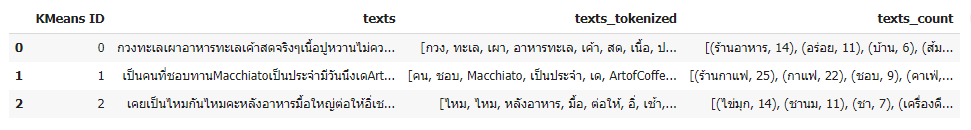
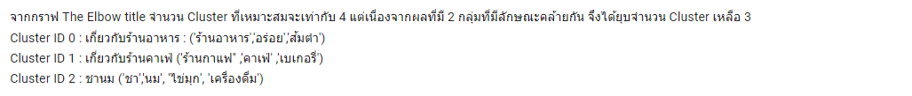

## Voice of customer
We are using K-Mean clustering to cluster The wongnai review (300 review).

## Review data

## Embed sentences using Universal Sentence Encoder

## Dimension reduction

## Clustering result

## Interpret Result

